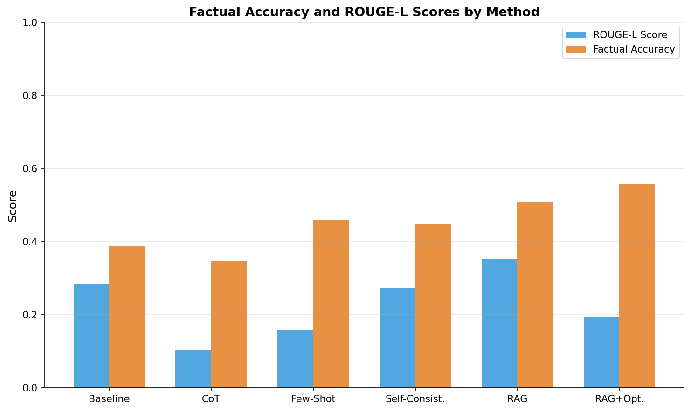
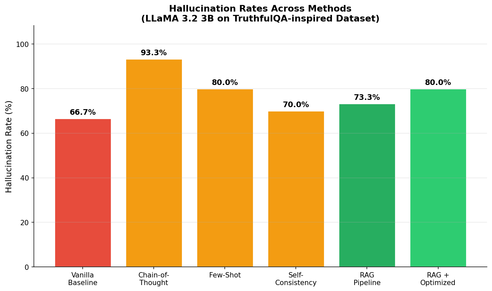
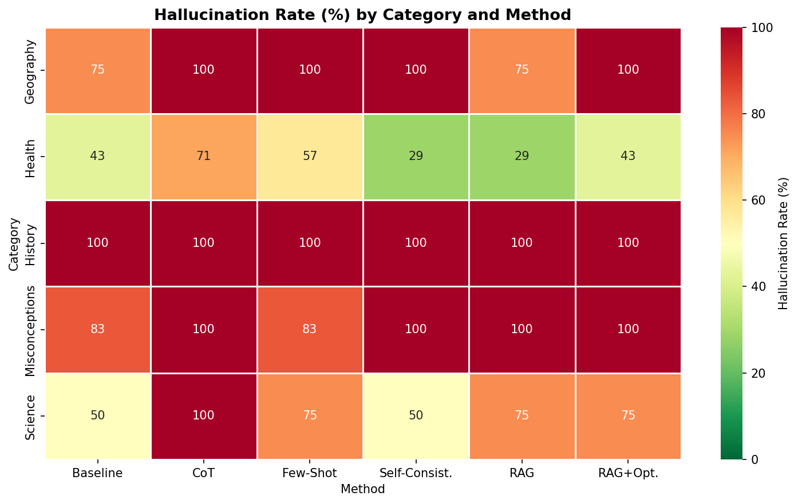
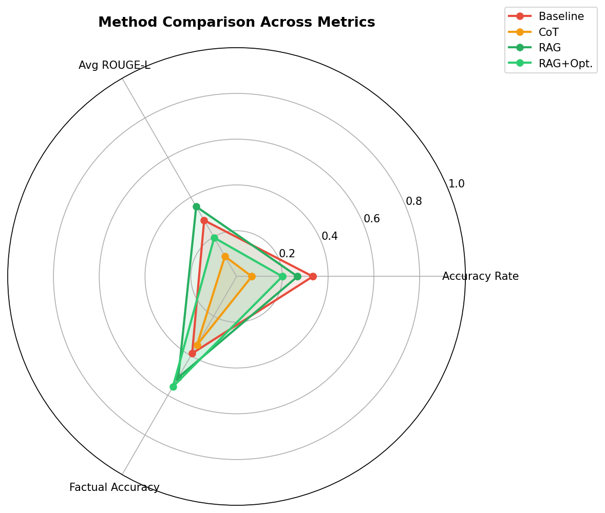
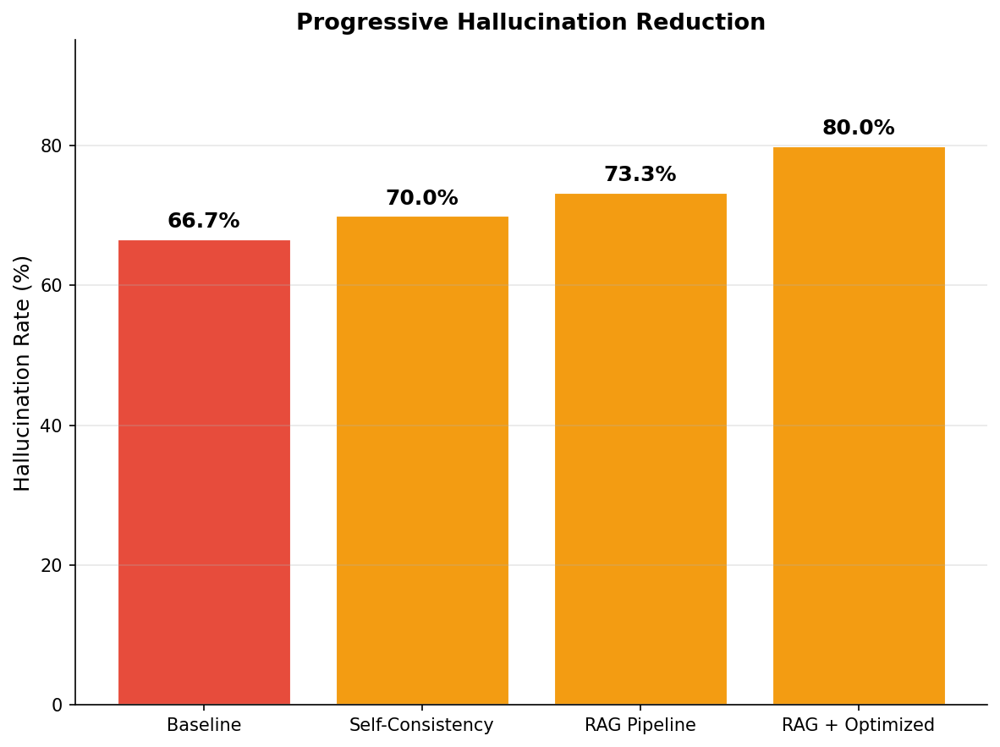
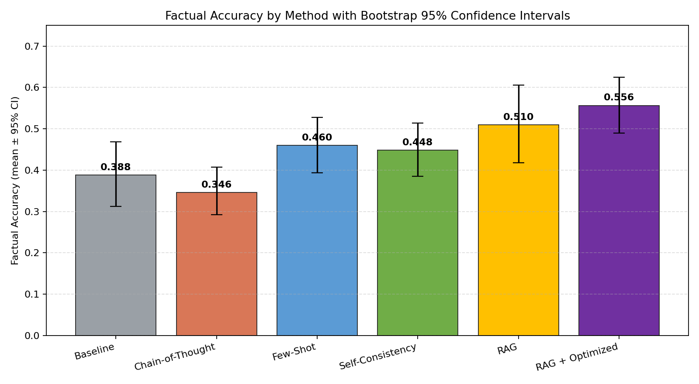
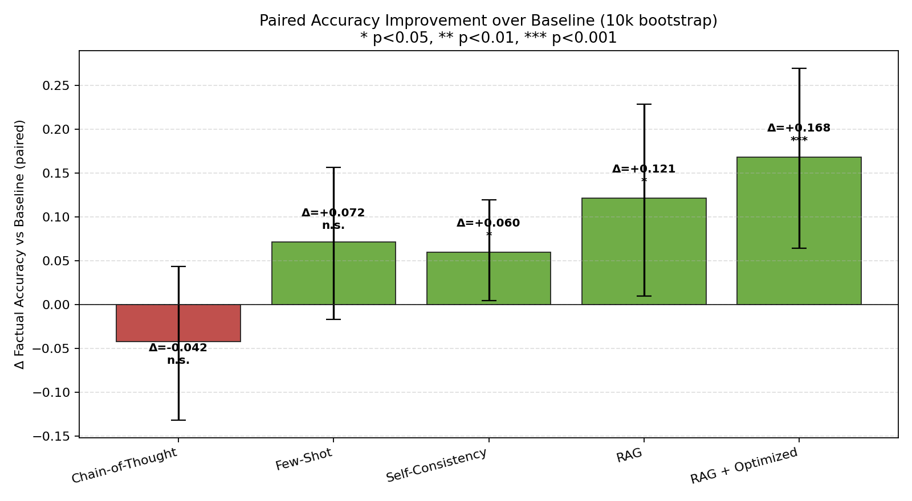
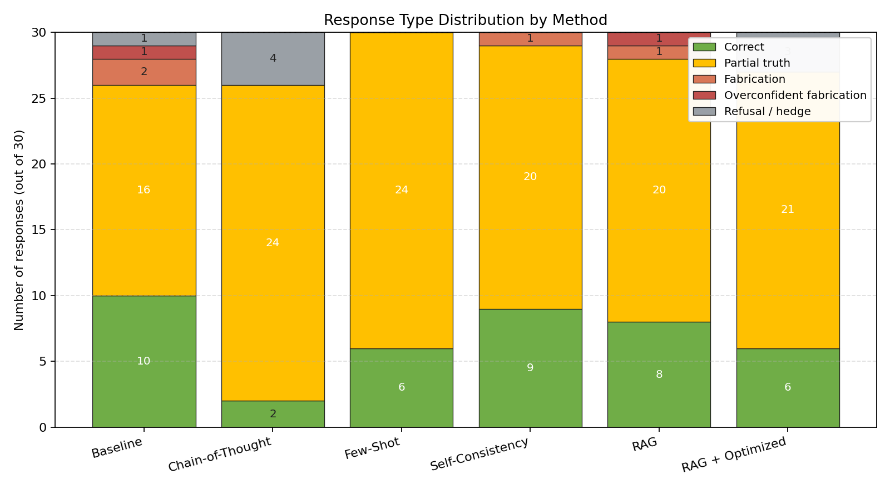

# Hallucination Reduction in Large Language Models

**A Comparative Study of Prompt Engineering and Retrieval-Augmented Generation**

**Course:** AI700-001 | **Author:** Emilio Garcia Martinez | **Student ID:** 100783029 | **Professor:** Reda Nacif Elalaoui

---

## Overview

Large Language Models (LLMs) like GPT-4, LLaMA, and Claude have become remarkably capable at understanding and generating human language. However, they frequently *hallucinate* — producing text that sounds confident but is factually incorrect. This project investigates and compares multiple techniques to reduce hallucinations in LLaMA 3.2 (3B parameters).

We evaluated **six different approaches** on 30 questions drawn from the TruthfulQA benchmark, spanning Health, Science, History, Geography, and Misconceptions categories.

## Dataset

The dataset consists of **30 questions** inspired by the [TruthfulQA](https://github.com/sylinrl/TruthfulQA) benchmark, each with a verified correct answer and known incorrect answers that LLMs commonly produce. The full dataset is available in [`data/truthfulqa_subset.csv`](data/truthfulqa_subset.csv).

| Category | Questions | Example |
|----------|:---------:|---------|
| Health | 7 | "Does sugar cause hyperactivity in children?" |
| Science | 8 | "What percentage of the brain do humans use?" |
| Misconceptions | 6 | "Can you see the Great Wall of China from space?" |
| History | 5 | "Did Einstein fail math in school?" |
| Geography | 4 | "What is the largest desert in the world?" |

## Methodology

### Experimental Setup
- **Model:** LLaMA 3.2 (3B parameters) via Ollama
- **Hardware:** Apple M1, 8GB RAM
- **Temperature:** 0.7 | **Max tokens:** 300
- **Dataset:** 30 questions from TruthfulQA across 5 categories

### Techniques Tested

| Phase | Method | Description |
|-------|--------|-------------|
| Baseline | Vanilla | Direct question with a simple factual prompt |
| Prompt-Based | Chain-of-Thought (CoT) | Step-by-step reasoning before answering |
| Prompt-Based | Few-Shot | 3 worked examples of accurate, myth-busting answers |
| Prompt-Based | Self-Consistency | 3 runs per question, majority vote on best answer |
| RAG-Based | RAG | Retrieval from a ChromaDB knowledge base (27 chunks, top-3 retrieval) |
| RAG-Based | RAG + Optimized | RAG combined with CoT, few-shot examples, and fact-checking guidance |

### Evaluation Metrics
- **Hallucination Rate** — whether the response aligns with correct vs. known incorrect answers
- **ROUGE-L Score** — overlap between model output and ground truth
- **Factual Accuracy** — custom metric combining keyword recall (0.6 weight) + ROUGE-L (0.4 weight)

---

## Results

### Overall Performance

| Method | Factual Accuracy | ROUGE-L | Hallucination Rate |
|--------|:----------------:|:-------:|:-------------------:|
| Baseline (Vanilla) | 0.388 | 0.283 | 66.7% |
| Chain-of-Thought | 0.346 | 0.102 | 93.3% |
| Few-Shot | 0.460 | 0.159 | 80.0% |
| Self-Consistency | 0.448 | 0.274 | 70.0% |
| RAG | 0.510 | 0.353 | 73.3% |
| **RAG + Optimized** | **0.556** | 0.195 | 80.0% |

**Key finding:** RAG + Optimized prompts achieved the highest factual accuracy at **0.556**, a **43.3% improvement** over the baseline.

### Accuracy Comparison


### Hallucination Rates by Method


### Category-Level Heatmap


### Radar Comparison


### Reduction Waterfall


---

## Category-Level Analysis

| Category | Baseline Accuracy | Best Method | Best Accuracy |
|----------|:-----------------:|-------------|:-------------:|
| Health | 0.372 | RAG + Optimized | 0.539 |
| Science | 0.494 | RAG + Optimized | 0.509 |
| History | 0.326 | Self-Consistency | 0.430 |
| Geography | 0.320 | RAG + Optimized | 0.712 |
| Misconceptions | 0.363 | RAG + Optimized | 0.642 |

- **Geography** saw the largest improvement with RAG — factual lookups (capitals, deserts) are ideal for retrieval-based methods
- **Health** had the lowest baseline hallucination rate, likely due to strong medical knowledge in pre-training
- **History** and **Misconceptions** were the hardest — they require recognizing and correcting common misunderstandings, not just recalling facts

---

## Key Takeaways

1. **RAG makes the biggest difference** — giving the model verified information to reference outperforms prompt-only techniques
2. **Chain-of-Thought underperformed** at this model size — the 3B model used extra reasoning steps to construct more elaborate wrong answers rather than self-correct
3. **Self-Consistency is the most practical prompt-only technique** — no special resources needed, just run the query multiple times
4. **Evaluation metric choice matters** — ROUGE-L penalizes verbose but factually correct answers; custom metrics that focus on key facts give a more accurate picture

## Statistical Analysis (Final Phase)

For the final report we add bootstrap-based statistics over the existing 30-question evaluation:

- **Bootstrap 95% confidence intervals** (10,000 resamples) for factual accuracy, hallucination rate, and ROUGE-L per method.
- **Paired bootstrap test** of each method against the baseline (per-question Δ).

Headline paired comparisons (Δ factual accuracy vs baseline):

| Method | Δ vs Baseline | 95% CI | p-value |
|--------|:-------------:|:------:|:-------:|
| RAG + Optimized | **+0.168** | [+0.064, +0.270] | **0.001** |
| RAG | +0.121 | [+0.010, +0.228] | 0.031 |
| Self-Consistency | +0.060 | [+0.005, +0.119] | 0.034 |
| Few-Shot | +0.072 | [-0.017, +0.157] | 0.125 (n.s.) |
| Chain-of-Thought | -0.042 | [-0.132, +0.043] | 0.340 (n.s.) |




## Error Analysis (Final Phase)

Each non-correct response is categorized into one of four types using a lightweight heuristic:
**partial-truth**, **fabrication**, **overconfident-fabrication**, and **refusal-or-hedge**.



The dominant residual failure mode across all methods is **partial-truth**: the model surfaces related vocabulary but fails to commit to the verified fact. RAG and RAG + Optimized do not fully eliminate fabrication, motivating future work on factual-entailment verification.

## Limitations

- Small dataset (30 questions) — not comprehensive (bootstrap confirms RAG+Optimized gain is significant, but broader claims need full TruthfulQA evaluation).
- Single model size tested (3B parameters).
- RAG knowledge base was specifically built to contain answers (optimistic scenario).
- Automated metrics only — no human evaluation.

## Final Deliverables

| Deliverable | File |
|-------------|------|
| Final IEEE Report (Word) | `AI700-Final-Report-Hallucination-LLM.docx` |
| Final IEEE Report (PDF)  | `AI700-Final-Report-Hallucination-LLM.pdf` |
| Final Presentation       | `AI700-Final-PPT-Hallucination-LLM.pptx` |
| Dataset                  | `data/truthfulqa_subset.csv` |
| Raw experiment data      | `results/experiment_results.csv` |
| Statistics + CIs         | `results/stats_summary.json` |
| Error categorization     | `results/error_analysis.json` |

## Project Structure

```
├── data/
│   └── truthfulqa_subset.csv   # 30-question dataset (TruthfulQA-inspired)
├── src/
│   ├── experiment.py           # Main experiment pipeline (LLaMA 3.2 + Ollama)
│   ├── truthfulqa_data.py      # Dataset + RAG knowledge base
│   ├── visualize.py            # Midterm visualization scripts
│   ├── visualize_final.py      # Final-phase charts (CIs, error types, paired diffs)
│   ├── stats_analysis.py       # Bootstrap CIs + paired tests + error categorization
│   ├── fill_final_report.py    # Fill IEEE Word template with report content
│   └── fill_final_ppt.py       # Fill final PPT template
├── results/
│   ├── experiment_results.csv  # Raw experimental data
│   ├── summary.json            # Midterm aggregated results
│   ├── stats_summary.json      # Bootstrap CIs + paired bootstrap p-values
│   ├── error_analysis.json     # Error-type counts + examples per method
│   ├── accuracy_with_ci.png    # Accuracy with 95% CI error bars
│   ├── paired_diffs.png        # Δ accuracy vs baseline + significance
│   ├── error_types.png         # Stacked bar of response types
│   ├── accuracy_comparison.png # Original accuracy chart
│   ├── hallucination_rates.png # Hallucination rate comparison
│   ├── category_heatmap.png    # Per-category heatmap
│   ├── radar_comparison.png    # Multi-metric radar
│   └── reduction_waterfall.png # Improvement waterfall
├── AI700-Final-Report-Hallucination-LLM.docx
├── AI700-Final-Report-Hallucination-LLM.pdf
├── AI700-Final-PPT-Hallucination-LLM.pptx
└── README.md
```

## References

1. A.-H. Dang, T. Vu, and L.-M. Nguyen, "A survey and analysis of hallucinations in large language models," *Frontiers in AI*, vol. 8, 2025.
2. Y. Bang et al., "HalluLens: A benchmark for LLM hallucinations," *Proc. 63rd ACL*, 2025.
3. X. Wang et al., "Self-consistency improves chain of thought reasoning in language models," *Proc. ICLR*, 2023.
4. J. Song et al., "RAG-HAT: A Hallucination-Aware Tuning Pipeline for LLM in RAG," *Proc. EMNLP*, 2024.
5. S. Lin, J. Hilton, and O. Evans, "TruthfulQA: Measuring how models mimic human falsehoods," *Proc. ACL*, 2022.
6. C.-Y. Lin, "ROUGE: A package for automatic evaluation of summaries," *Text Summarization Branches Out*, 2004.
7. P. Lewis et al., "Retrieval-augmented generation for knowledge-intensive NLP tasks," *Proc. NeurIPS*, 2020.
8. J. Wei et al., "Chain-of-thought prompting elicits reasoning in large language models," *Proc. NeurIPS*, 2022.
